# Does Jupiter have anything to do with the 11-year solar cycle? Bayesian inference to the rescue!

[Solar cycles](https://en.wikipedia.org/wiki/Solar_cycle), defined based on the number of [sunspots](https://en.wikipedia.org/wiki/Sunspot) present on the Sun's surface, exhibit nearly periodic 11-year changes. These fluctuations affect the levels of solar radiation, the ejection of solar material, and the number and size of sunspots, solar flares, and coronal loops [1].

|Monthly mean total sunspot number|A group of sunspots [2]|
|:-:|:-:|
|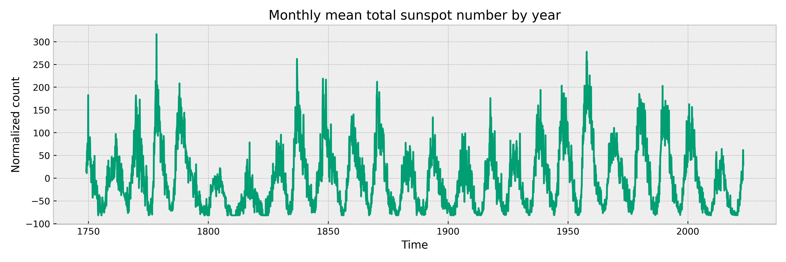|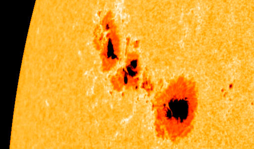|

The orbital period of Jupiter around the Sun is 11.862 years. So, *does Jupiter have anything to do with the 11-year cycle*?  
In this project, we use the number of sunspots observed in the last centuries and `Bayesian inference` techniques to try to answer this question, by:
- Approximating the time series of sunspot observations as a sum of harmonic waves plus background noise using Fourier analysis;
- Sampling in the model parameter space using [emcee](https://github.com/dfm/emcee) [3], a Python-based ensemble sampler for Markov chain Monte Carlo (MCMC).

## Installing dependencies and reproducing results

The code comes with all the dependencies that can be installed from the requirements file. However, we recommend creating a virtual environment using a package manager like [Miniconda](https://docs.conda.io/en/latest/miniconda.html). To create a virtual environment and install the dependencies, run:

```bash
conda create -n bayesian-inference python==3.11
conda activate bayesian-inference
pip install -r requirements.txt
```

To execute the scripts and reproduce the results, run:

```bash
python src/fourier.py
python src/sampling.py
```

## Method

We briefly describe the two phases of the method below. For more information and implementation details, please refer to the code.

### Fourier approximation

Let $`\{y_i\}_{i=1}^{N_s}`$ be the time series of the monthly mean total sunspot number, collected at times $`\{t_i\}_{i=1}^{N_s}`$ expressed in years. The data is made available by [4]. We assume that the observations follow a background periodic signal given by a sum of $n$ cosine waves plus a Gaussian random noise with time-independent variance, according to the model:

```math
y_i\sim\mathcal{N}\left(\sum_{j=1}^{n}A_j\cos{\left(\frac{2\pi}{T_j}t_i+\phi_j\right)},\sigma^{2}\right)\quad{i=1,\dots,N_s}
```

To estimate the $3n+1$ parameters $`\underline{\theta}=(\{A_j,T_j,\phi_j\}_{j=1}^n,\sigma)`$, in the script `fourier.py` we iteratively extract the most dominant frequency from the Fourier spectrum and subtract it from the signal for $n$ times, until only noise is left. We find $n=15$ to be a good enough approximation for this purpose, as can be seen below.

|Original vs reconstructed signal using n=15 Fourier components|
|:-:|
|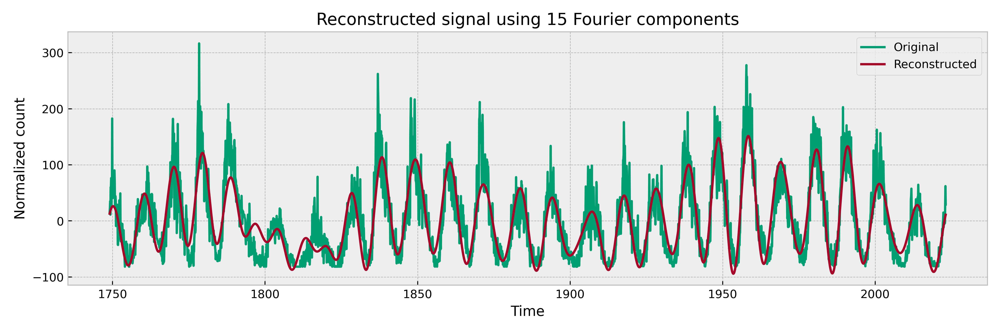|

|Time series of the residuals|Distribution of the residuals|
|:-:|:-:|
|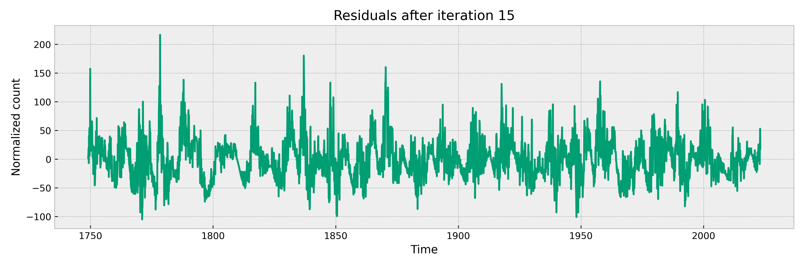|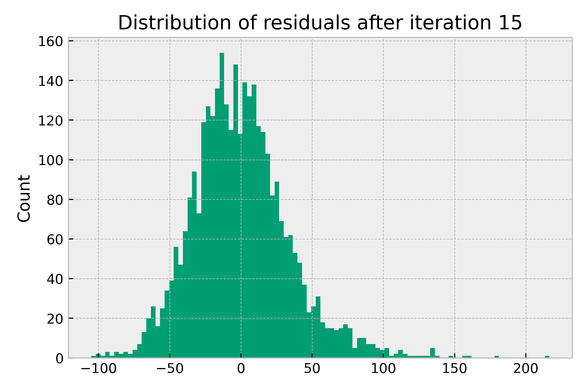|

### Sampling

In the `sampling.py` script, we sample in the high dimensional and multi-modal parameter space of $\underline{\theta}\in\mathbb{R}^{3n+1}$ using `emcee` to globally optimize and correct the estimates as well as to quantify the uncertainty in each dimension. By using Bayes' theorem, we compute the posterior distribution according to:

```math
\underbrace{P(\underline{\theta}\mid\underline{y})}_{\text{Posterior}}=\frac{P(\underline{\theta})P(\underline{y}\mid\underline{\theta})}{P(\underline{y})}\propto\underbrace{P(\{A_j,T_j,\phi_j\}_{j=1}^n,\sigma)}_{\text{Prior}}\underbrace{P(\underline{y}\mid\{A_j,T_j,\phi_j\}_{j=1}^n,\sigma)}_{\text{Likelihood}}
```

We use these priors on the parameters:
- Uninformative priors on $`\{A_j\}_{j=1}^n`$ and $`\{T_j\}_{j=1}^n`$;
- Gaussian priors with zero mean and standard deviation set to $\pi$ for $`\{\phi_j\}_{j=1}^n`$;
- Jeffreys prior on $\sigma > 0$.

Combining everything, we have that the logarithm of the posterior has the form:

```math
\log{P(\underline{\theta}\mid\underline{y})}=\underbrace{-\log(\sigma)}_{\text{Jeffreys prior}}\overbrace{-\frac{1}{2\pi^2}\sum_{j=1}^n\phi_j^2}^{\text{Gaussian prior}}\underbrace{-\frac{N_s}{2}\log(2\pi\sigma^2)-\frac{1}{2\sigma^2}\sum_{i=1}^{N_s}\left(y_i-\sum_{j=1}^{n}A_j\cos{\left(\frac{2\pi}{T_j}t_i+\phi_j\right)}\right)^2}_{\text{Likelihood for normally distributed data}}
```

Running a chain of 50k steps, all parameters converge to their respective posterior distributions. We can see the chains for a few selected parameters $A_5,T_5,\phi_5$ and $\sigma$ as well as how the sampling quickly converges to a better posterior than the Fourier initialization.

|Selected amplitude and period chains|Selected phase and noise chains|Log posterior chains|
|:-:|:-:|:-:|
|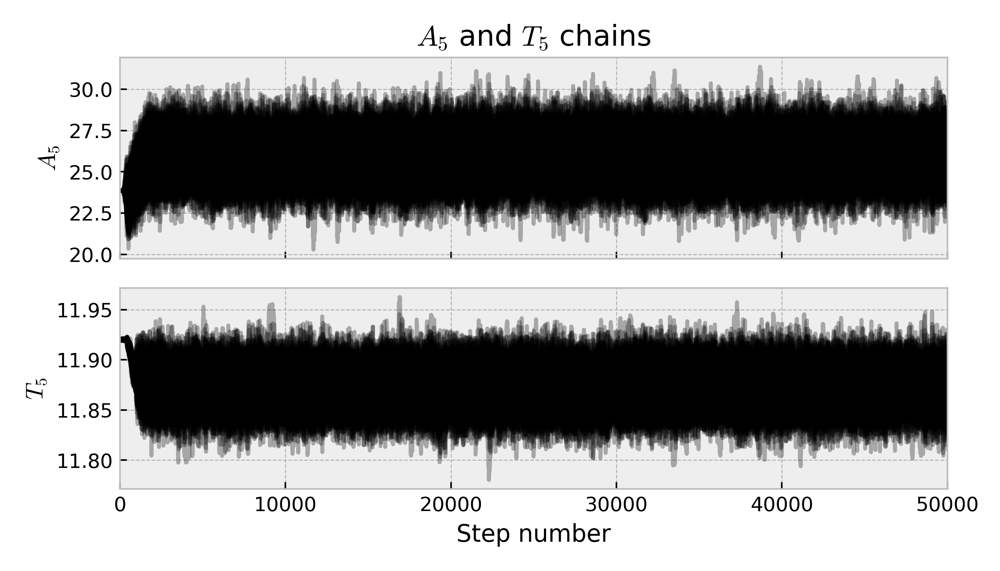|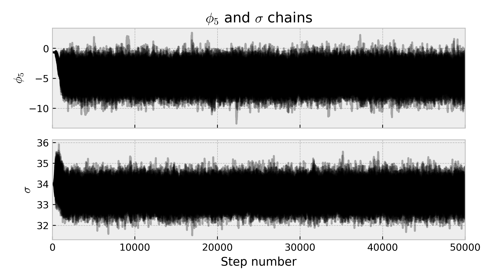|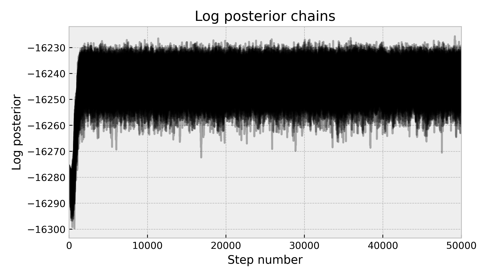|

We can compute an updated parameter estimate $`\underline{\theta}_{\text{mean}}`$ by taking the average of the samples we collected after removing the burn-in stage and thinning the chains. The signal induced by $`\underline{\theta}_{\text{mean}}`$ has shifted slightly from the original position, and an improvement in the likelihood suggests that it has moved towards the right direction, even though this is not straightforward to see given the complexity of the model.

|Initial estimate and new mean estimate into the observed data space|
|:-:|
|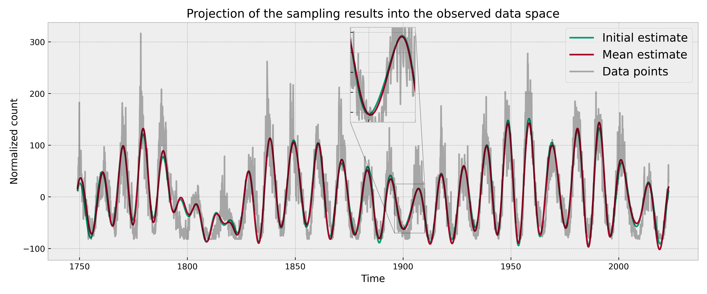|

|Mean signal and 2-sigma posterior spread into the observed data space|
|:-:|
|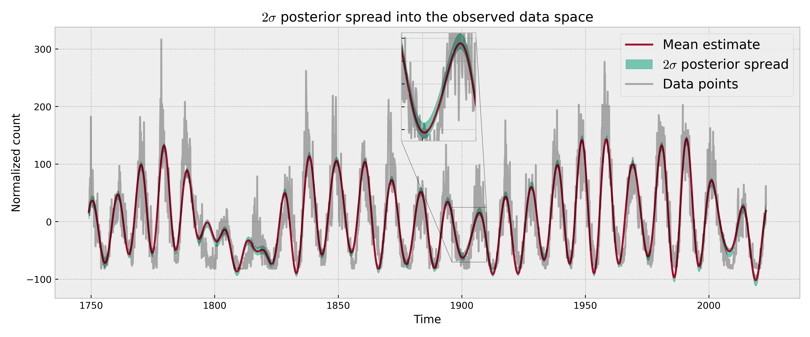|

## Back to the original question...

The initial parameters have all been modified by the inference process, converging to a better estimate. In particular, $T_5$, originally the closest period to the target value 11.862, has not only moved towards the orbital period of Jupiter but is also perfectly compatible with it.

|Fifth period distribution – compatible with Jupiter|
|:-:|
|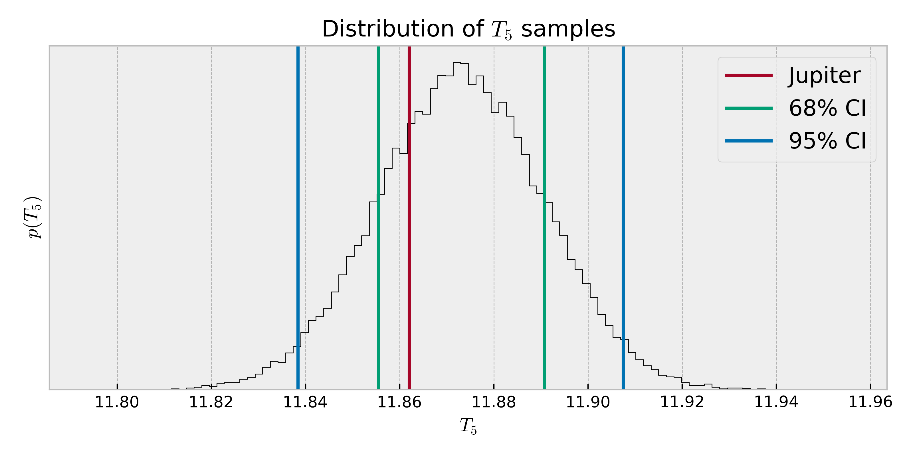|

Therefore we conclude, according to our inference process, that *Jupiter is likely to play a role in shaping the signal*.

## References

[1] Wikipedia, "Solar cycle", https://en.wikipedia.org/wiki/Solar_cycle  
[2] Wikipedia, "Sunspot", https://en.wikipedia.org/wiki/Sunspot  
[3] Foreman-Mackey et al., "emcee: The MCMC Hammer", https://arxiv.org/abs/1202.3665, https://github.com/dfm/emcee  
[4] WDC-SILSO, Royal Observatory of Belgium, Brussels, "Monthly mean total sunspot number [1/1749 - 1/2023]", https://www.sidc.be/SILSO/datafiles
